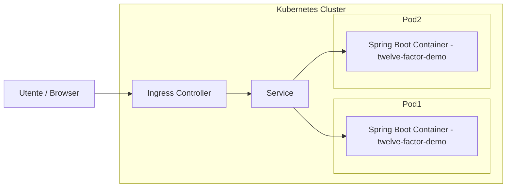

## 🧭 Struttura del progetto Kubernetes

```
k8s/
├── configmap.yaml
├── secret.yaml
├── deployment.yaml
├── service.yaml
└── ingress.yaml   # opzionale
```

---

## ⚙️ 1. ConfigMap

**k8s/configmap.yaml**

```yaml
apiVersion: v1
kind: ConfigMap
metadata:
  name: twelve-factor-demo-config
data:
  SPRING_PROFILES_ACTIVE: "prod"
  APP_MESSAGE: "Hello from Kubernetes! This is the 12-Factor App."
```

---

## 🔐 2. Secret

**k8s/secret.yaml**

```yaml
apiVersion: v1
kind: Secret
metadata:
  name: twelve-factor-demo-secret
type: Opaque
data:
  DB_PASSWORD: bXlwYXNzd29yZA==   # base64("mypassword")
```

---

## 🚀 3. Deployment

**k8s/deployment.yaml**

```yaml
apiVersion: apps/v1
kind: Deployment
metadata:
  name: twelve-factor-demo
  labels:
    app: twelve-factor-demo
spec:
  replicas: 2
  selector:
    matchLabels:
      app: twelve-factor-demo
  template:
    metadata:
      labels:
        app: twelve-factor-demo
    spec:
      containers:
      - name: twelve-factor-demo
        image: alf/twelve-factor-demo:1.0.0
        imagePullPolicy: IfNotPresent
        ports:
        - containerPort: 8080
        envFrom:
        - configMapRef:
            name: twelve-factor-demo-config
        - secretRef:
            name: twelve-factor-demo-secret
        readinessProbe:
          httpGet:
            path: /actuator/health
            port: 8080
          initialDelaySeconds: 5
          periodSeconds: 10
        livenessProbe:
          httpGet:
            path: /actuator/health
            port: 8080
          initialDelaySeconds: 15
          periodSeconds: 20
```

---

## 🌐 4. Service

**k8s/service.yaml**

```yaml
apiVersion: v1
kind: Service
metadata:
  name: twelve-factor-demo-service
spec:
  selector:
    app: twelve-factor-demo
  ports:
  - protocol: TCP
    port: 80
    targetPort: 8080
  type: NodePort
```

---

## 🌍 5. Ingress (facoltativo)

**k8s/ingress.yaml**

```yaml
apiVersion: networking.k8s.io/v1
kind: Ingress
metadata:
  name: twelve-factor-demo-ingress
spec:
  rules:
  - host: twelve-factor.local
    http:
      paths:
      - path: /
        pathType: Prefix
        backend:
          service:
            name: twelve-factor-demo-service
            port:
              number: 80
```

---

## 🧩 6. Comandi di Deploy

```bash
kubectl apply -f k8s/configmap.yaml
kubectl apply -f k8s/secret.yaml
kubectl apply -f k8s/deployment.yaml
kubectl apply -f k8s/service.yaml
kubectl apply -f k8s/ingress.yaml   # solo se si usa ingress
```

Verifica lo stato:

```bash
kubectl get pods
kubectl get svc
kubectl get deployments
```

---

## 🧪 7. Test dell’applicazione

Con **minikube**:

```bash
minikube service twelve-factor-demo-service
```

Oppure con **Ingress**:

1. Aggiungere nel  `/etc/hosts`:

   ```
   127.0.0.1 twelve-factor.local
   ```
2. Apri:

   ```
   http://twelve-factor.local
   ```

---

## 🔁 8. Rollout, Scaling e Self-Healing

Aggiornamento dell’immagine:

```bash
kubectl set image deployment/twelve-factor-demo twelve-factor-demo=alf/twelve-factor-demo:1.0.1
kubectl rollout status deployment/twelve-factor-demo
```

Rollback:

```bash
kubectl rollout undo deployment/twelve-factor-demo
```

Scaling:

```bash
kubectl scale deployment/twelve-factor-demo --replicas=4
```

---

## 📈 9. Diagramma Concettuale (Mermaid)



---

## 🧰 10. Suggerimento: Script di Deploy automatico

Si può creare un file `deploy.sh` per semplificare l’esecuzione:

```bash
#!/bin/bash
set -e

echo "🔧 Applying Kubernetes manifests..."
kubectl apply -f k8s/configmap.yaml
kubectl apply -f k8s/secret.yaml
kubectl apply -f k8s/deployment.yaml
kubectl apply -f k8s/service.yaml
kubectl apply -f k8s/ingress.yaml || true

echo "✅ Deployment complete!"
kubectl get pods -l app=twelve-factor-demo
kubectl get svc twelve-factor-demo-service
```