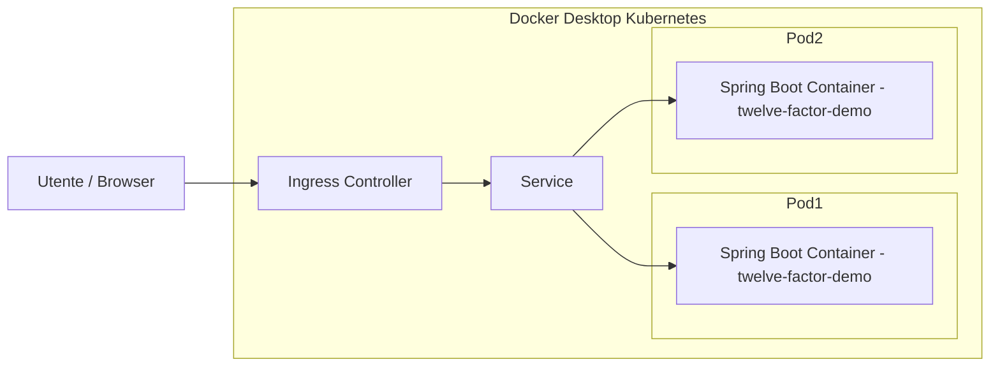

# 🐳 Kubernetes Configuration per Docker Desktop

## 🧭 Struttura del progetto Kubernetes

```
k8s/
├── configmap.yaml
├── secret.yaml
├── deployment.yaml
├── service.yaml
└── ingress.yaml   # opzionale
```

---

## ⚙️ 1. ConfigMap

**k8s/configmap.yaml**

```yaml
apiVersion: v1
kind: ConfigMap
metadata:
  name: twelve-factor-demo-config
data:
  SPRING_PROFILES_ACTIVE: "prod"
  APP_MESSAGE: "Hello from Kubernetes! This is the 12-Factor App."
```

---

## 🔐 2. Secret

**k8s/secret.yaml**

```yaml
apiVersion: v1
kind: Secret
metadata:
  name: twelve-factor-demo-secret
type: Opaque
data:
  DB_PASSWORD: bXlwYXNzd29yZA==   # base64("mypassword")
```

---

## 🚀 3. Deployment

**k8s/deployment.yaml**

```yaml
apiVersion: apps/v1
kind: Deployment
metadata:
  name: twelve-factor-demo
  labels:
    app: twelve-factor-demo
spec:
  replicas: 2
  selector:
    matchLabels:
      app: twelve-factor-demo
  template:
    metadata:
      labels:
        app: twelve-factor-demo
    spec:
      # Optional: set imagePullSecrets if your image is hosted on a private registry
      # imagePullSecrets:
      # - name: my-registry-secret
      terminationGracePeriodSeconds: 30
      securityContext:
        runAsNonRoot: true
        runAsUser: 1000
      containers:
        - name: twelve-factor-demo
          # Use a local image name by default so it works in local clusters (minikube/kind)
          # Replace with your registry image (e.g. myorg/twelve-factor-demo:1.0.0) for production
          image: twelve-factor-demo:1.0.0
          imagePullPolicy: IfNotPresent
          ports:
            - containerPort: 8080
          envFrom:
            - configMapRef:
                name: twelve-factor-demo-config
            - secretRef:
                name: twelve-factor-demo-secret
          env:
            - name: SERVER_PORT
              valueFrom:
                configMapKeyRef:
                  name: twelve-factor-demo-config
                  key: SERVER_PORT
            - name: GREETING_PREFIX
              valueFrom:
                configMapKeyRef:
                  name: twelve-factor-demo-config
                  key: GREETING_PREFIX
            - name: APP_VERSION
              valueFrom:
                configMapKeyRef:
                  name: twelve-factor-demo-config
                  key: APP_VERSION
            - name: APP_MESSAGE
              valueFrom:
                configMapKeyRef:
                  name: twelve-factor-demo-config
                  key: APP_MESSAGE
          resources:
            requests:
              cpu: "100m"
              memory: "128Mi"
            limits:
              cpu: "500m"
              memory: "512Mi"
          readinessProbe:
            httpGet:
              path: /actuator/health
              port: 8080
            initialDelaySeconds: 10
            periodSeconds: 10
            failureThreshold: 3
          livenessProbe:
            httpGet:
              path: /actuator/health
              port: 8080
            initialDelaySeconds: 30
            periodSeconds: 20
            failureThreshold: 3
```

---

## 🌐 4. Service

**k8s/service.yaml**

```yaml
apiVersion: v1
kind: Service
metadata:
  name: twelve-factor-demo-service
spec:
  selector:
    app: twelve-factor-demo
  ports:
  - protocol: TCP
    port: 80
    targetPort: 8080
  type: ClusterIP  # Modificato da NodePort per Docker Desktop
```

---

## 🌍 5. Ingress (raccomandato per Docker Desktop)

**k8s/ingress.yaml**

```yaml
apiVersion: networking.k8s.io/v1
kind: Ingress
metadata:
  name: twelve-factor-demo-ingress
  annotations:
    kubernetes.io/ingress.class: "nginx"
spec:
  rules:
  - host: twelve-factor.local
    http:
      paths:
      - path: /
        pathType: Prefix
        backend:
          service:
            name: twelve-factor-demo-service
            port:
              number: 80
```

---

## 🧩 6. Comandi di Deploy

```bash
# Assicurati che Kubernetes sia abilitato in Docker Desktop
kubectl apply -f k8s/configmap.yaml
kubectl apply -f k8s/secret.yaml
kubectl apply -f k8s/deployment.yaml
kubectl apply -f k8s/service.yaml
kubectl apply -f k8s/ingress.yaml   # raccomandato per Docker Desktop
```

Verifica lo stato:

```bash
kubectl get pods
kubectl get svc
kubectl get deployments
kubectl get ingress
```

---

## 🧪 7. Test dell'applicazione con Docker Desktop

### Opzione 1: Usando Ingress (raccomandata)

1. **Abilita Ingress Controller in Docker Desktop:**
    - Vai su Docker Desktop → Settings → Kubernetes
    - Seleziona "Enable Ingress Controller"

2. **Aggiungi al file `/etc/hosts` (macOS/Linux) o `C:\Windows\System32\drivers\etc\hosts` (Windows):**
   ```
   127.0.0.1 twelve-factor.local
   ```

3. **Accedi all'applicazione:**
   ```
   http://twelve-factor.local
   ```

### Opzione 2: Port Forwarding (alternativa)

```bash
kubectl port-forward service/twelve-factor-demo-service 8080:80
```

Poi visita: `http://localhost:8080`

---

## 🔁 8. Rollout, Scaling e Self-Healing

Aggiornamento dell'immagine:

```bash
kubectl set image deployment/twelve-factor-demo twelve-factor-demo=alf/twelve-factor-demo:1.0.1
kubectl rollout status deployment/twelve-factor-demo
```

Rollback:

```bash
kubectl rollout undo deployment/twelve-factor-demo
```

Scaling:

```bash
kubectl scale deployment/twelve-factor-demo --replicas=4
```

---

## 📈 9. Diagramma Concettuale (Mermaid)



---

## 🧰 10. Script di Deploy automatico per Docker Desktop

**deploy.sh**

```bash
#!/bin/bash
set -e

echo "🔧 Verifico che Docker Desktop Kubernetes sia attivo..."
kubectl cluster-info

echo "🚀 Applying Kubernetes manifests..."
kubectl apply -f k8s/configmap.yaml
kubectl apply -f k8s/secret.yaml
kubectl apply -f k8s/deployment.yaml
kubectl apply -f k8s/service.yaml
kubectl apply -f k8s/ingress.yaml

echo "⏳ Attendo che i pod siano ready..."
kubectl wait --for=condition=ready pod -l app=twelve-factor-demo --timeout=60s

echo "✅ Deployment completato!"
echo ""
echo "📊 Stato del deployment:"
kubectl get pods -l app=twelve-factor-demo
echo ""
echo "🌐 Servizi:"
kubectl get svc twelve-factor-demo-service
echo ""
echo "🔗 Ingress:"
kubectl get ingress twelve-factor-demo-ingress
echo ""
echo "🎯 Per testare l'applicazione:"
echo "1. Assicurati di avere questa riga in /etc/hosts:"
echo "   127.0.0.1 twelve-factor.local"
echo "2. Visita: http://twelve-factor.local"
```

---

## 🔧 Configurazione aggiuntiva per Docker Desktop

### Verifica dell'ambiente Docker Desktop

```bash
# Verifica che Kubernetes sia attivo
kubectl cluster-info

# Verifica i nodi
kubectl get nodes

# Verifica i namespace
kubectl get namespaces
```

### Pulizia delle risorse

```bash
# Elimina tutte le risorse del progetto
kubectl delete -f k8s/

# Oppure elimina singolarmente
kubectl delete deployment twelve-factor-demo
kubectl delete service twelve-factor-demo-service
kubectl delete ingress twelve-factor-demo-ingress
kubectl delete configmap twelve-factor-demo-config
kubectl delete secret twelve-factor-demo-secret
```

### Monitoraggio in tempo reale

```bash
# Monitora i pod
kubectl get pods -w

# Log in tempo reale
kubectl logs -f deployment/twelve-factor-demo

# Descrizione dettagliata
kubectl describe deployment twelve-factor-demo
```